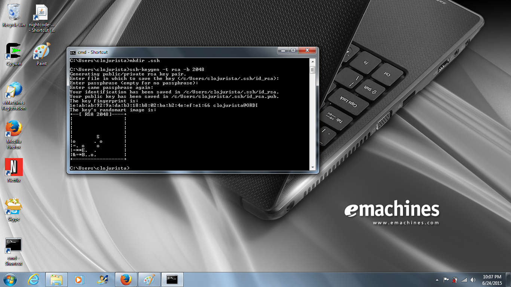

# Create an SSH key

Go to the...
* prev section [Install the Heroku Toolbelt](setup_new_heroku.md)
* new [Setup](setup_new.md) instructions
* next section [Setup github](setup_new_github.md)

--------------

## Open a command terminal

Yes you will learn how to talk to the computer _directly on the command line_!

The instructions for opening a terminal vary by platform:

* Mac: [Launch the Terminal application](http://blog.teamtreehouse.com/introduction-to-the-mac-os-x-command-line)
* Windows: [Launch cmd.exe](http://www.7tutorials.com/7-ways-launch-command-prompt-windows-7-windows-8)
* Linux: [Launch a Terminal](https://help.ubuntu.com/community/UsingTheTerminal)

## Create the .ssh directory

Now you have a terminal Window open you can go to your "HOME" directory.
On Mac and Linux this is almost certainly the directory your Terminal
window will start in (or you can type `cd $HOME`). On Windows you
can type `cd %USERPROFILE%`.

From here you can create a directory to store your SSH keys:

    mkdir .ssh

## Generate a new SSH key

Now you can actually create a new SSH key by typing in the
following command and parameters:

    ssh-keygen -t rsa -b 2048

You can see what this looks like in the screenshot below.
You don't have to choose a passphrase.. you can just leave it blank!
Just press _RETURN_ for all the questions.

## Extra credit (_not required for the installfest_)

Typically developers _do_ have a passphrase for their
SSH keys... However this means that every time a service
needs to access your private key that you are prompted
for your passphrase. We skipped that here for simplicity.

They way to have better security _and_ convenience is to
use an agent to cache your passphrase so you only have
to enter it once per session. On Linux you can use
[ssh-agent](https://en.wikipedia.org/wiki/Ssh-agent)
(part of the `openssh-client` package)
directly or as part of a desktop session
like Gnome with the [seahorse](https://wiki.gnome.org/Apps/Seahorse) utility.

On Mac...

On Windows...

## Resources

* [The art of the command line](https://github.com/jlevy/the-art-of-command-line)
* [25 Terminal Tips Every Mac User Should Know](http://www.maclife.com/article/feature/25_terminal_tips_every_mac_user_should_know)
