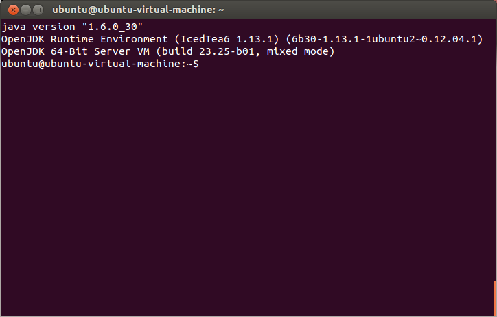

Ubuntu Setup
==========

* Start a terminal
* Make sure Java is installed
* Get Nightcode installed
* Test installation
* 
## Starting a terminal

For these instructions you will need to have a terminal, or command line, open. This is a text-based interface to talk to your computer, and you can open it by clicking "Dash Home" and typing `Terminal`. You can also open a terminal at any time by pressing `CTRL-ALT-T`. If you have never used the terminal before, you may want to spend some time [reading up on command-line basics](http://blog.teamtreehouse.com/command-line-basics).

Go ahead and open your terminal now. It should look something like this:


The prompt (where you will type your commands) may look different: it usually shows the computer name and user name, as well as the folder or directory you are currently in.

For the rest of this setup, I will tell you to run commands in your terminal. When I say that, I mean "type the command into the terminal and press the Return key."

## Making sure Java is installed

Run `java -version` in your terminal. If you do not have Java installed, Ubuntu will prompt you to install it. It should look something like this:


Follow all of the directions Ubuntu gives you, selecting the package "openjdk-7-jre-headless" then return to this part of the tutorial and run `java -version` again.

If Java is installed, you will see something like this in your terminal:



The details of Java's version may differ from what you see above; that is perfectly fine.

## Installing NightCode
Nightcode will be where you will be actually doing you Clojure programming! 

   

Click here [NightCode 1.0.1]([Nightcode 1.0.1](https://github.com/oakes/Nightcode/releases/download/1.0.1/nightcode-1.0.1-standalone.jar) to download Nightcode. 

There should now be a file named `nightcode-1.0.1-standalone.jar` in your Downloads folder, move it to your Applications folder.

You should be able to open NightCode by just double clicking on `nightcode-1.0.1-standalone.jar` but if that doesn't work you will need to open the terminal(see above) and type `java -jar <path to nightcode download>`. Here is an example, if you have downloaded Nightcode to `~/tools/nightcode`, you would type the following in the terminal.

```
java -jar ~/tools/nightcode/nightcode-1.0.1-standalone.jar
```

Now follow to instructions for your track to get the Clojure project you will be working on: 

- [Track 1: turtles](setup_track1.md).
- [Track 2: Clojure koans](setup_track2.md). 
