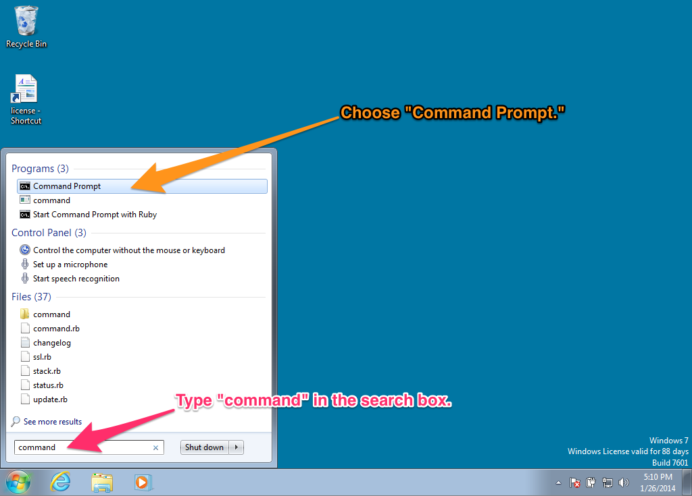
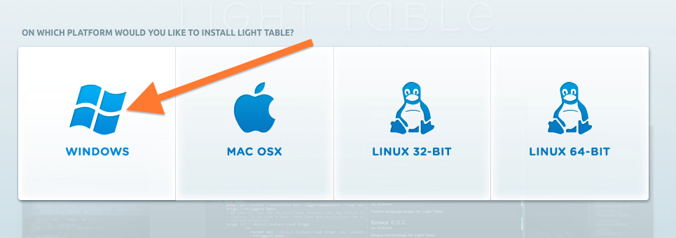
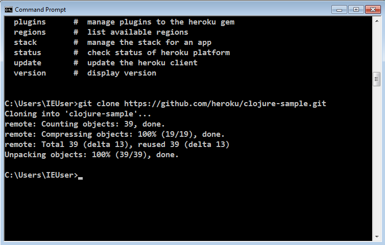

Windows 7 Setup
===============

* Start a command prompt
* Get Java installed
* Get Leiningen installed
* Get Light Table installed
* Get Heroku installed (includes Git)
* Test installation
* Troubleshooting

## Starting a command prompt

For these instructions, and for much of the class, you will need to have a command prompt open. This is a text-based interface to talk to your computer. Go to the Start Menu and type "command" in the search box. Choose the "Command Prompt" program, like in this screenshot:



When you choose "Command Prompt," your screen should look similar to this:


If you have never used the command prompt before, you may want to spend some time [reading up on command prompt basics](http://dosprompt.info/). For the rest of this setup, I will tell you to run commands in your command prompt. When I say that, I mean "type the command into the command prompt and press the Return key."

On other operating systems, the command prompt is called the terminal. We will use the terms terminal, command prompt, and command line interchangably.

## Installing Java

Go to [the Leiningen Windows installer site](http://leiningen-win-installer.djpowell.net/). You should see two links, one for installing Java and another for "leiningen-win-installer." Click the Java link. Then, you should see a screen like the following:


Click the button above "Java Platform (JDK)," as you can see in the above picture. Then you will come to a page that will have the following table on it:


Click the radio button to accept the license agreement, and then download one of the two Windows choices. If you are running 32-bit Windows, choose "Windows x86." If you are running 64-bit Windows, choose "Windows x64."

If you do not know if you are running 32-bit or 64-bit Windows, go to the Control Panel (Start Menu - Control Panel) and choose "System and Security" and then "System." You should see a window like the following:


You should see if you are running 32- or 64-bit Windows beside "System Type."

Once you have downloaded the right Java version, run the executable you downloaded to install Java. Follow the installation wizard.

## Installing Leiningen

Leiningen is a tool used on the command line to manage Clojure projects.

Next, go back to [the Leiningen Windows installer site](http://leiningen-win-installer.djpowell.net/) and download the file linked as "leiningen-win-installer." Run this executable and follow the "Detailed installation" section at the Leiningen Windows Installer site. At the end of the installation, leave "Run a Clojure REPL" checked before you click "Finish." If a terminal window opens that looks like the one on the Leiningen Windows installer site, then you are good to go.

## Installing Light Table

Go to the [Light Table site](http://www.lighttable.com/). On the page there, you should see a set of buttons that have download links for Light Table. Click the "Win" button and you will download a .zip file.



Unzip this file (either by finding it in your Downloads folder and double-clicking it, or by choosing "Open" when downloading.) Inside the .zip file, there is a a directory called "Light Table". Drag this to your desktop. (If you know what you are doing and want this somewhere else, that is fine.)

Inside the Light Table directory, there is an application called Light Table. Right-click it and choose "Pin to Start Menu" so you can start it more quickly.

## Get setup with Heroku

Heroku is the tool we will use in order to put your application online where others can see it.

First, we need to create an account. Go to [Heroku](http://heroku.com) and click the "Sign up" link.


You will be taken to a form where you need to enter your email address in order to sign up. Fill out that form, and you will be sent an email with a link to click to continue the signup process.


After clicking on the link, you will be taken to another form where you will need to choose a password. Choose one and enter it twice.


After all that, you should be at your Heroku dashboard. There will be a link on the dashboard to download the Heroku Toolbelt. Download it now.


You will download an .exe file. Run this executable to install the Heroku Toolbelt and follow all prompts from the installation wizard.

Before you can use Heroku, you will have to set up SSH, the way your computer communicates with Heroku.

First, look up what your user directory is. You can find it by running `echo %USERPROFILE%`. Create a place for your SSH keys by running this command:

```
mkdir "%USERPROFILE%\.ssh"
```

Then, if you have 32-bit Windows, run this command:

```
"C:\Program Files\Git\bin\ssh-keygen.exe"
```

If you have 64-bit Windows, run this command instead:

```
"C:\Program Files (x86)\Git\bin\ssh-keygen.exe"
```

The quotes are necessary on the `ssh-keygen.exe` command. When you run `ssh-keygen.exe`, you will need to type the name of your user directory - everything from "C:\" onward - plus `\.ssh\id_rsa` when it asks you where to save the key. Be careful to type everything exactly. When it asks to 'Enter passphrase' just hit Enter, then Enter again. *Look at the following example:*


After that, close the command prompt, open it again, and run the command `heroku login`. You will be prompted for your email and password on Heroku. If you enter them and the command ends successfully, congratulations!

## Testing your setup

You have set up Java, Leiningen, Light Table, Git, and Heroku on your computer, all the tools you will need for this program. Before starting, we need to test them out. Make sure you have a terminal (OS X) or command prompt (Windows) open for testing. We will just call this a terminal from now on.

Go to your terminal and run the following command:

`git clone https://github.com/heroku/clojure-sample.git`

This will check out a sample Clojure application from GitHub, a central repository for lots of source code. Your terminal should look similar to this picture:



Then run the command:

`cd clojure-sample`

This will put you in the directory with the source code for this sample bit of Clojure code. After that completes, run:

`lein repl`

This could take a long time, and will download many other pieces of code it relies on. You should see lines that start with `Retrieving ...` on your screen. When it finishes, your terminal should look like the following:


This is starting a REPL, which we will learn about soon. It's a special terminal for Clojure. At the REPL prompt, type `(+  1  1)` and hit enter. Did you get the answer `2` back? You will learn more about that in the course. For now, press the Control button and D button on your keyboard together (abbreviated as Ctrl+D). This should take you out of the Clojure REPL and back to your normal terminal prompt.

Now, start Light Table. Once it is started, press the Control button and Space Bar together (abbreviated Ctrl+Space). This is how you start giving Light Table a command. Start typing the word "instarepl" and you should see a menu of options, like below. Choose "Instarepl: open a clojure instarepl."


At the bottom of the screen, you will see a cube moving and some text about connecting and installing dependencies. Once that stops moving, type `(+ 1 1)` into the window. It should look like the following image:


If that worked, great! Close Light Table. We only have one more thing to test, Heroku.

Go back to your terminal. You should still be in the `clojure-sample` directory.

Run this command:

`heroku create`

There should be output about something being created. A URL will be displayed. Look at the following example:


Next, run the following commands:

```
git push heroku master

heroku open
```

Enter "yes" if you are asked if you are sure you want to connect.

Your browser should open (and take a long time to load) and you should see a website like the following:


Congratulations! That website is running code you have on your computer that you have uploaded. You have actually made a very simple Clojure app, and your computer is all set up to make more.

## Troubleshooting

  Students with Windows 7 may get the error below when they run `lein repl` for the first time.

  ```
  Address family not supported by protocol family: connect
  ```

  If the error message is this, look at <http://stackoverflow.com/a/21383865>.


  This error happens because `lein` command couldn't download necessary stuffs
  because a program called Relevant Knowledge, some sort of spyware, blocks the traffic.
  To solve this problem, uninstall Relevant Knowledge.
  This requires users' (owner's or administrator's) password.
  Sometimes, attendees haven't heard of such permission stuff.
  Be ready for that.
