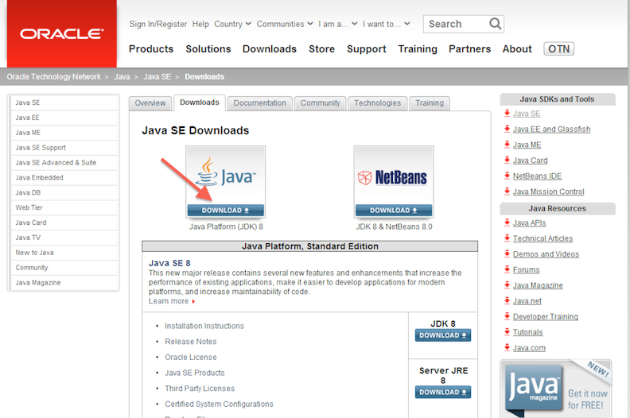

Windows 7 Setup
===============

* Get Java installed
* Get Nightcode installed
* Test installation

<!--
## Starting a command prompt

For these instructions, and for much of the class, you will need to have a command prompt open. This is a text-based interface to talk to your computer. Go to the Start Menu and type "command" in the search box. Choose the "Command Prompt" program, like in this screenshot:

When you choose "Command Prompt," your screen should look similar to this:

If you have never used the command prompt before, you may want to spend some time [reading up on command prompt basics](http://dosprompt.info/). For the rest of this setup, I will tell you to run commands in your command prompt. When I say that, I mean "type the command into the command prompt and press the Return key."

On other operating systems, the command prompt is called the terminal. We will use the terms terminal, command prompt, and command line interchangably.
-->

## Installing Java

Go to [Oracle Java Development Kit (JDK) 8 download site](http://www.oracle.com/technetwork/java/javase/downloads/jdk8-downloads-2133151.html).  You should see a screen like the following:

Click the button above "Java Platform (JDK)," as you can see in the above picture. Then you will come to a page that will have the following table on it:

Click the radio button to accept the license agreement, and then download one of the two Windows choices. If you are running 32-bit Windows, choose "Windows x86." If you are running 64-bit Windows, choose "Windows x64."

If you do not know if you are running 32-bit or 64-bit Windows, go to the Control Panel (Start Menu - Control Panel) and choose "System and Security" and then "System." You should see a window like the following:

You should see if you are running 32- or 64-bit Windows beside "System Type."

Once you have downloaded the right Java version, run the executable you downloaded to by double-clicking on it. Follow the installation wizard.

Note: when you are asked for a name of the folder that Java would be installed in, make sure that the suggested folder name has no spaces in it. If there are spaces, replace them with underscores. 

## Installing Nightcode

Nightcode is a Clojure IDE (Integrated Development Environment, which means that it is a text editor, like Word, only specialized for writing programs) that comes bundled with other tools useful for 
working with Clojure. 

Note that we will be using Nightcode **1.3.2**, not any of the later versions of Nightcode. 

To download and install Nightcode 1.3.2, go to [https://github.com/oakes/Nightcode/releases/tag/1.3.2](https://github.com/oakes/Nightcode/releases/tag/1.3.2). 
Under Downloads, click on **nightcode-1.3.2-standalone.jar**. 
Once it downloads, you might want to drag it into your `Programs` folder or any other place where it would be convenient to access it later (you also might want to create a folder for Clojure work and put it there). 
After you move it, double-click on it to start. 

You may get a message indicating that this type of files may be harmful for your computer and asking you if you still would like to run it. Allow running it. If you get a message that the firewall has blocked some of its features, click "allow access". 

Once Nightcode is successfully installed, it will start and look like the picture above (only without all the code).

Now follow to instructions for your track to get the Clojure project you will be working on: 

- [Track 1: turtles](setup_track1.md).
- [Track 2: Clojure koans](setup_track2.md). 

